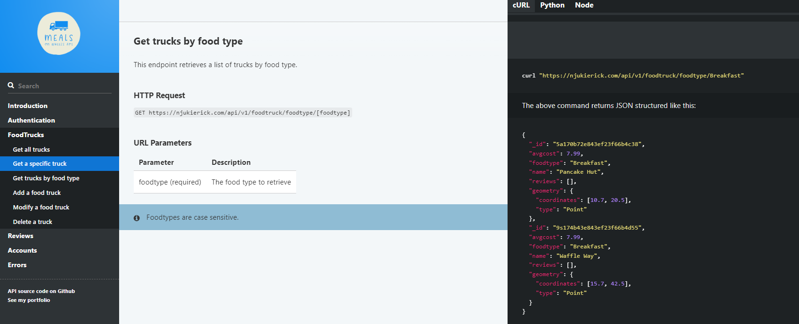

# MealsonWheels API Reference Docs

This single-page html [API documentation](https://njukierick.github.io/MealsonWheels-API-Documentation/) includes Node (JavaScript), Python, and cURL code samples for all GET, POST, PUT, and DELETE API operations, as well as info on authentication, errors, and an overview. It is written in Markdown and published using Slate.

